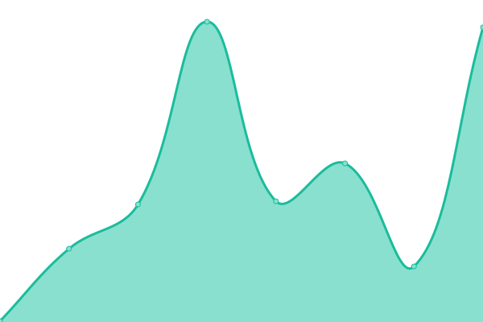
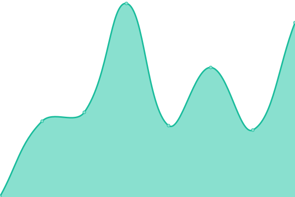

# [📈 Live Status](https://benjamin-hx.github.io/statuspage): <!--live status--> **🟩 All systems operational**

This repository contains the open-source uptime monitor and status page for [benjamin-hx](https://benjamin-hx.github.io/statuspage), powered by [Upptime](https://github.com/upptime/upptime).

With [Upptime](https://upptime.js.org), you can get your own unlimited and free uptime monitor and status page, powered entirely by a GitHub repository. We use [Issues](https://github.com/benjamin-hx/statuspage/issues) as incident reports, [Actions](https://github.com/benjamin-hx/statuspage/actions) as uptime monitors, and [Pages](https://benjamin-hx.github.io/statuspage) for the status page.

<!--start: status pages-->
<!-- This summary is generated by Upptime (https://github.com/upptime/upptime) -->
<!-- Do not edit this manually, your changes will be overwritten -->
<!-- prettier-ignore -->
| URL | Status | History | Response Time | Uptime |
| --- | ------ | ------- | ------------- | ------ |
|  [Holiday Extras](https://www.holidayextras.com) | 🟩 Up | [holiday-extras.yml](https://github.com/benjamin-hx/statuspage/commits/HEAD/history/holiday-extras.yml) | 

 188ms
     
 | 

<a href="https://benjamin-hx.github.io/statuspage/history/holiday-extras">100.00%</a>
    

|  [Google](https://www.google.com) | 🟩 Up | [google.yml](https://github.com/benjamin-hx/statuspage/commits/HEAD/history/google.yml) | 

 109ms
     
 | 

<a href="https://benjamin-hx.github.io/statuspage/history/google">100.00%</a>
    

|  [Outline](https://holidayextras.getoutline.com) | 🟩 Up | [outline.yml](https://github.com/benjamin-hx/statuspage/commits/HEAD/history/outline.yml) | 

 305ms
     
 | 

<a href="https://benjamin-hx.github.io/statuspage/history/outline">100.00%</a>
    

|  [Cloudflare](https://www.cloudflarestatus.com) | 🟩 Up | [cloudflare.yml](https://github.com/benjamin-hx/statuspage/commits/HEAD/history/cloudflare.yml) | 

 311ms
     
 | 

<a href="https://benjamin-hx.github.io/statuspage/history/cloudflare">97.37%</a>
    

|  [Slack](https://slack.com) | 🟩 Up | [slack.yml](https://github.com/benjamin-hx/statuspage/commits/HEAD/history/slack.yml) | 

 324ms
     
 | 

<a href="https://benjamin-hx.github.io/statuspage/history/slack">100.00%</a>
    

|  [Jira](https://holidayextras.jira.com) | 🟩 Up | [jira.yml](https://github.com/benjamin-hx/statuspage/commits/HEAD/history/jira.yml) | 

 1476ms
     
 | 

<a href="https://benjamin-hx.github.io/statuspage/history/jira">100.00%</a>
    

|  [NPM](https://status.npmjs.org) | 🟩 Up | [npm.yml](https://github.com/benjamin-hx/statuspage/commits/HEAD/history/npm.yml) | 

 281ms
     
 | 

<a href="https://benjamin-hx.github.io/statuspage/history/npm">96.32%</a>
    

|  [Gemini](https://gemini.google.com) | 🟩 Up | [gemini.yml](https://github.com/benjamin-hx/statuspage/commits/HEAD/history/gemini.yml) | 

 151ms
     
 | 

<a href="https://benjamin-hx.github.io/statuspage/history/gemini">100.00%</a>
    

|  [ChatGPT](https://status.openai.com) | 🟩 Up | [chat-gpt.yml](https://github.com/benjamin-hx/statuspage/commits/HEAD/history/chat-gpt.yml) | 

 490ms
     
 | 

<a href="https://benjamin-hx.github.io/statuspage/history/chat-gpt">90.78%</a>
    

<!--end: status pages-->

[**Visit our status website →**](https://benjamin-hx.github.io/statuspage)

## 📄 License

- Powered by: [Upptime](https://github.com/upptime/upptime)
- Code: [MIT](./LICENSE) © [Anand Chowdhary](https://anandchowdhary.com), supported by [Pabio](https://pabio.com)
- Data in the `./history` directory: [Open Database License](https://opendatacommons.org/licenses/odbl/1-0/)
